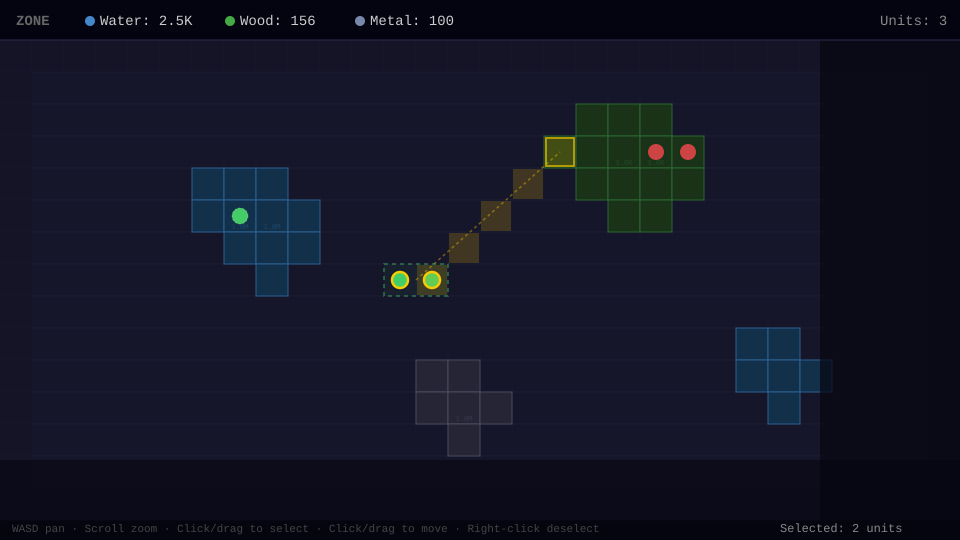

# Zone

Real-time multiplayer territory control game. Explore a 1000x1000 tile map, command units, and mine resources through fog of war.



## Getting Started

```bash
go run .
```

Open [http://localhost:8080](http://localhost:8080) in your browser. Enter a player name to connect.

## Gameplay

- You spawn with **3 units** and **100 of each resource** (water, wood, metal)
- **Select units** by clicking them, or drag a box to select multiple
- **Move units** by clicking a destination tile, or drag to distribute across an area
- Units move **1 tile per tick** (1 second) along a diagonal-then-straight path
- **Idle units on resource tiles** automatically mine that resource each tick
- Resources deplete over time — wood nodes have 1K supply, water and metal have 1M
- **Fog of war** limits vision to 10 tiles around each unit
- Previously explored areas remain dimmed on the map
- Your map is **saved to localStorage** and persists across sessions

## Controls

| Input | Action |
|---|---|
| **WASD** / Arrow keys | Pan camera |
| **Scroll wheel** | Zoom in/out |
| **Left click** unit | Select unit |
| **Left click** tile | Move selected units |
| **Click + drag** (no selection) | Box select units |
| **Click + drag** (with selection) | Distribute units across area |
| **Shift + click** | Add unit to selection |
| **Right click** / Escape | Deselect |

## Tech Stack

- **Backend:** Go with Chi router and Gorilla WebSocket
- **Frontend:** Vanilla JavaScript, HTML5 Canvas
- **Protocol:** WebSocket — server ticks once per second and broadcasts visible tiles to each player

## Architecture

```
main.go        Server, WebSocket handler, game loop, graph building
player.go      Player state and resource inventory
node.go        Map tile with resource type, supply, and depletion
member.go      Units that players control
resources.go   Resource type definitions and supply constants
static/        Frontend client served as static files
```

The server maintains a 1000x1000 tile grid. Each tick it moves units, depletes mined resources, and sends each connected player only the tiles within their fog-of-war radius. Resources spawn in natural clusters using randomized BFS growth.
